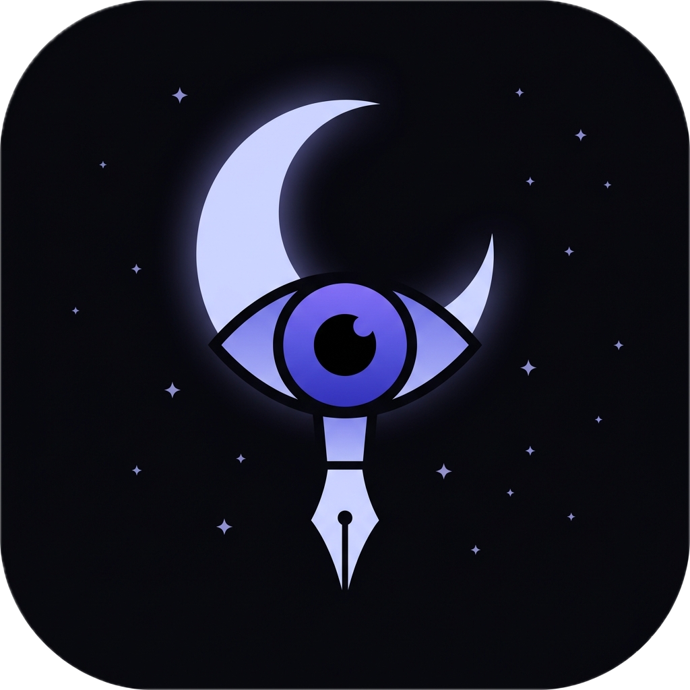
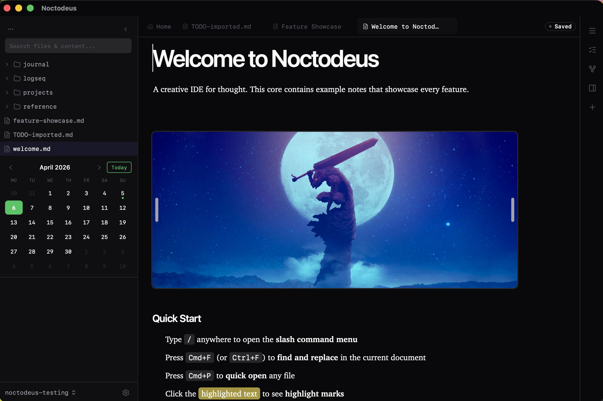
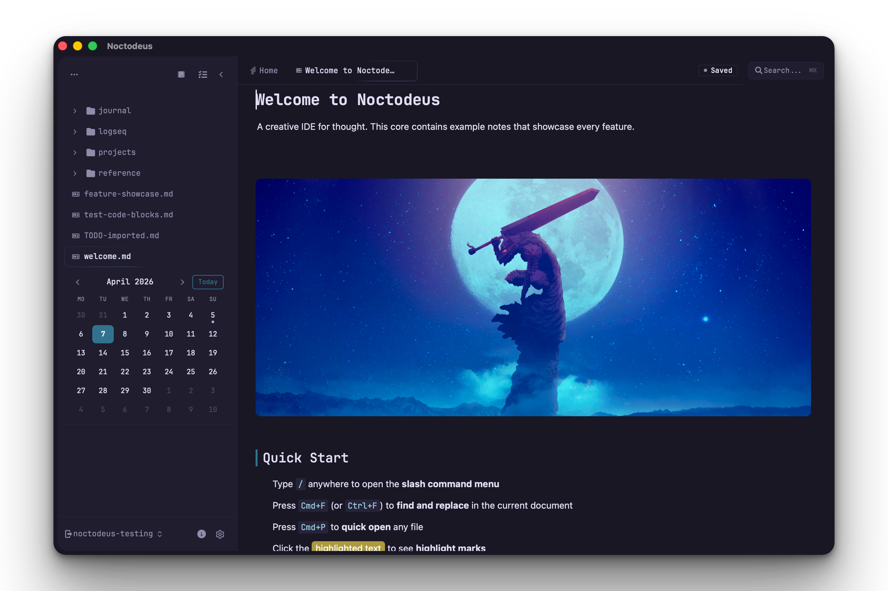

<p align="center">
  
</p>

<h1 align="center">Noctodeus</h1>

<p align="center">
  <a href="https://github.com/neur0map/noctodeus/releases/latest">Download</a> &middot;
  <a href="#what-it-does">What It Does</a> &middot;
  <a href="#install">Install</a> &middot;
  <a href="#shortcuts">Shortcuts</a> &middot;
  <a href="https://github.com/neur0map/noctodeus/issues">Feedback</a>
</p>

<p align="center">
  
  
  
</p>

<br />

<p align="center">
  
</p>

## Why This Exists

You already have Obsidian, Logseq, Notion. They work. They have teams, funding, and years of polish.

Noctodeus is one person building the note app they actually want to use.

The whole thing is one binary. No Electron. No hidden browser eating 400MB of RAM. Tauri 2 with a Rust backend, Svelte 5 frontend. Starts in under a second, sits around 80MB of memory, and your notes stay on your machine unless you push them to your own GitHub repo.

If you care about owning your tools and not just your data, give it 5 minutes.

---

## What It Does

**Markdown editor** with slash commands, tables, task lists, code blocks with syntax highlighting, and drag-and-drop images. WYSIWYG that saves as plain `.md` files. No proprietary format.

**`[[Wiki-links]]`** between notes. Backlinks in the side panel. Graph view that grows as you write.

**Full-text search** across every note. SQLite FTS5 with stemming, so "writing" matches "write" and "written." Highlighted snippets in results.

**Inline AI** — press `Space` on an empty line to ask the AI to write, edit, or transform content. Works with OpenAI, Anthropic, Ollama, OpenRouter, Groq, or any OpenAI-compatible API. Your key is stored locally.

**Fabric AI patterns** as slash commands — `/summarize`, `/improve-writing`, `/extract-wisdom`, `/create-outline`, `/explain-terms`, and more. Curated prompts adapted from [Fabric](https://github.com/danielmiessler/fabric).

**Chat bubble** — bottom-right assistant that can read and search your vault with native SQLite + RAG tools. No need to configure MCP servers for basic vault queries.

**Daily notes.** Click a date in the sidebar calendar. A templated journal entry appears. No plugins, no setup.

**GitHub sync.** One button. Pulls remote changes, merges, pushes. Two devices edit the same file? Both versions kept. No merge conflicts in your notes.

**8 themes** across dark, light, and warm palettes. Each one tuned across the entire UI, not just syntax colors.

**Customizable shortcuts, fonts, editor width, and custom CSS injection.**

**macOS and Linux.** Same app. Shortcuts adapt automatically (Cmd on Mac, Ctrl on Linux).

> **Windows status:** unavailable right now. The Rust dependency graph (ort + memvid-core + tantivy) trips the MSVC linker. Will return once the deps are refactored. Follow [this issue](https://github.com/neur0map/noctodeus/issues) for progress.

<p align="center">
  
</p>

---

## Install

Grab the latest build from the [releases page](https://github.com/neur0map/noctodeus/releases/latest).

| Platform | Arch | File |
|----------|------|------|
| macOS | Apple Silicon | `Noctodeus_*_aarch64.dmg` |
| macOS | Intel | `Noctodeus_*_x64.dmg` |
| Linux | x64 | `noctodeus_*_amd64.AppImage` / `noctodeus_*_amd64.deb` |

### macOS — first-launch Gatekeeper workaround

Noctodeus is **not code-signed or notarized** yet — paying Apple $99/year for a one-person project isn't happening yet. On first launch macOS will refuse to run the app with a *"Noctodeus is damaged and can't be opened"* or *"cannot verify the developer"* error.

**Fix it with one command:**

```bash
xattr -cr /Applications/Noctodeus.app
```

That strips the quarantine attribute Gatekeeper attaches to downloaded apps. You only need to do this once per install. After that the app opens normally like any other.

> If you're the cautious type: `xattr -cr` only clears extended attributes, it doesn't modify the binary. You can verify the app's integrity by checking the SHA on the [releases page](https://github.com/neur0map/noctodeus/releases/latest) before running it.

### Linux — AppImage or .deb

**AppImage** (portable, no install):

```bash
chmod +x Noctodeus_*.AppImage
./Noctodeus_*.AppImage
```

**Debian / Ubuntu** (`.deb`):

```bash
sudo dpkg -i noctodeus_*_amd64.deb
# or
sudo apt install ./noctodeus_*_amd64.deb
```

If the AppImage fails to launch on Wayland, try running with `WEBKIT_DISABLE_COMPOSITING_MODE=1`.

---

## Shortcuts

All rebindable in Settings > Hotkeys.

| | macOS | Linux |
|-|-------|-------|
| Quick Open | `Cmd+P` | `Ctrl+P` |
| Search | `Cmd+K` | `Ctrl+K` |
| Command Palette | `Cmd+Shift+P` | `Ctrl+Shift+P` |
| New Note | `Cmd+N` | `Ctrl+N` |
| Toggle Sidebar | `Cmd+B` | `Ctrl+B` |
| Toggle Right Panel | `Cmd+\` | `Ctrl+\` |
| AI Chat | `Cmd+J` | `Ctrl+J` |
| Find in Note | `Cmd+F` | `Ctrl+F` |

Inline AI: press `Space` on an empty line to open the prompt bar. Fabric patterns: type `/` and scroll to the **AI** group.

---

## Built With

Rust, [Tauri 2](https://tauri.app), [Svelte 5](https://svelte.dev), [BlockNote](https://www.blocknotejs.org/) (React bridge), SQLite + FTS5, and Tailwind CSS v4.

---

## Build From Source

```bash
# Needs: node 18+, Rust stable, git
# Linux prerequisites:
sudo apt install libwebkit2gtk-4.1-dev libappindicator3-dev librsvg2-dev patchelf

git clone https://github.com/neur0map/noctodeus.git
cd noctodeus
npm install
npm run tauri dev
```

To build a release bundle locally:

```bash
npm run tauri build
```

---

## Credits

Noctodeus stands on a lot of open-source shoulders:

- Editor — [BlockNote](https://www.blocknotejs.org/) (MPL-2.0)
- Icons — [Lucide](https://lucide.dev/) (ISC)
- AI patterns — adapted from [Fabric](https://github.com/danielmiessler/fabric) (MIT)
- Search — [SQLite FTS5](https://www.sqlite.org/fts5.html) + [tantivy](https://github.com/quickwit-oss/tantivy)
- Encrypted sharing — [Cryptgeon](https://cryptgeon.org/)
- App shell — [Tauri](https://tauri.app)

---

## Status

Early release. One person, used daily. Rough edges exist. File [an issue](https://github.com/neur0map/noctodeus/issues) if you find bugs or want something added — feedback directly shapes what gets built next.

---

## License

[AGPL-3.0](LICENSE)
