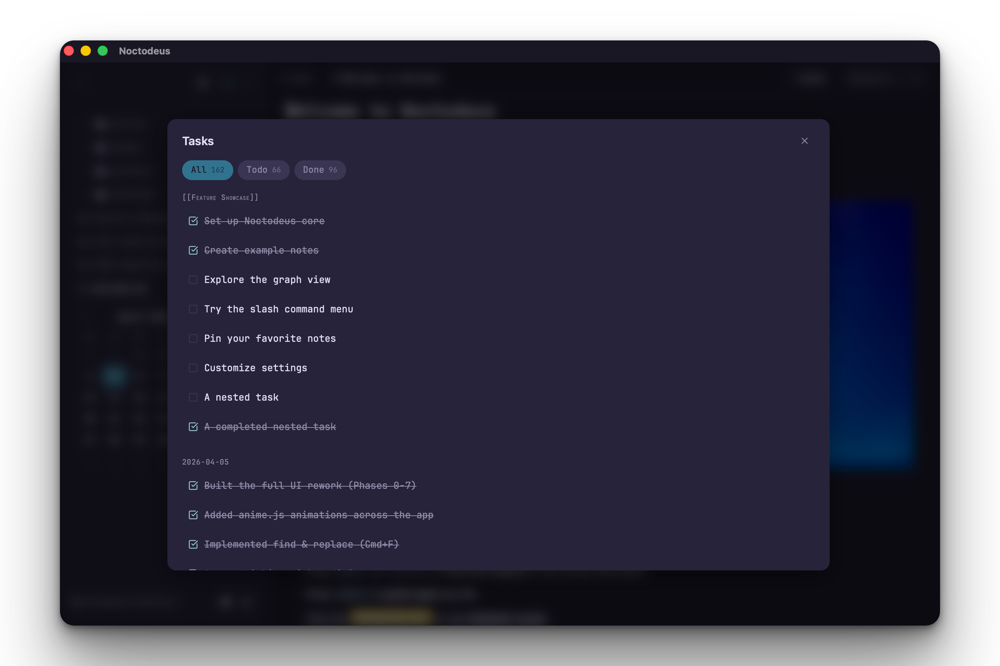
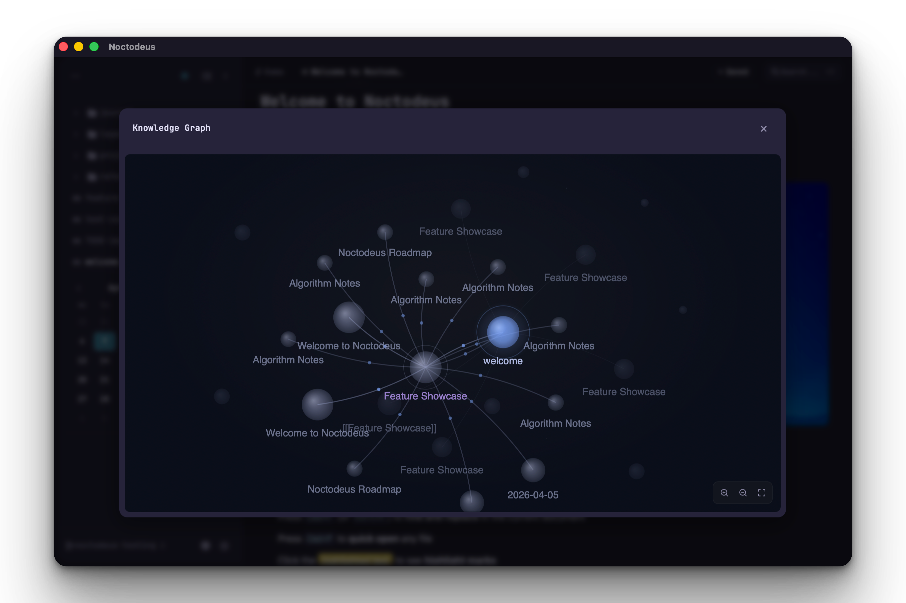
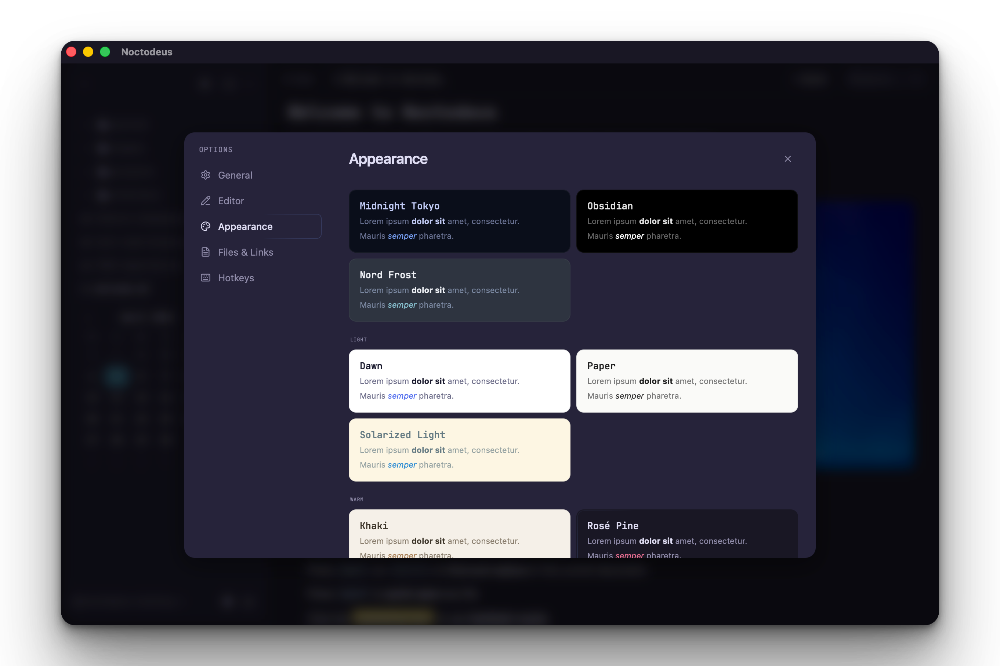

# Noctodeus

A nocturnal note-taking app for technical minds. Local-first, privacy-focused knowledge management built as a native desktop application with executable code blocks, persistent Python kernel, and a premium Midnight Tokyo aesthetic.


## Features

- **Rich markdown editor** — TipTap 3 with tables, math (KaTeX), code blocks with syntax highlighting, task lists, images, video, audio, embeds
- **Executable code blocks** — Multi-tab code regions in notes with persistent Python kernel (variables carry across blocks) and live HTML/CSS/JS preview with iframe rendering
- **Wiki links & graph view** — `[[link]]` syntax with backlinks, interactive knowledge graph with constellation-style visualization, alias resolution
- **Global search** — FTS5-powered search across file names, titles, and content with highlighted snippets (Cmd+K)
- **8 visual themes** — Midnight Tokyo, Obsidian, Nord Frost, Dawn, Paper, Solarized Light, Khaki, Rose Pine — with Bear-style preview cards
- **Daily notes & calendar** — Month calendar widget in sidebar, click any date to create/open a journal entry
- **Properties panel** — Collapsible YAML frontmatter editor with typed fields (text, tags, dates, checkboxes)
- **Task extraction** — Consolidated view of all tasks across your vault, filterable by status
- **Unlinked mentions** — Detects references to your notes that aren't linked yet, one-click to convert
- **Multiple cores** — Switch between vaults instantly from the sidebar dropdown
- **Find & replace** — In-editor search with match highlighting, case toggle, replace all
- **Edit/view toggle** — Switch between WYSIWYG editing and rendered preview
- **Export** — Markdown, HTML, CSV with optional media inclusion
- **Editable keyboard shortcuts** — Customize all keybindings from settings with live recording
- **Customizable** — Font families, editor width, custom CSS injection with documented selectors








## Stack

### Core

| Layer | Technology | Purpose |
|-------|-----------|---------|
| Desktop Shell | [Tauri 2](https://tauri.app) | Native desktop wrapper with Rust backend |
| Frontend Framework | [SvelteKit](https://kit.svelte.dev) + [Svelte 5](https://svelte.dev) | Reactive UI with runes-based state |
| Build Tool | [Vite 6](https://vitejs.dev) | Dev server, HMR, bundling |
| Language | [TypeScript 5.6](https://typescriptlang.org) | Type-safe frontend code |
| Backend Language | [Rust](https://rust-lang.org) (2021 edition) | Performance-critical backend logic |

### Editor

| Library | Purpose |
|---------|---------|
| [TipTap 3](https://tiptap.dev) | Headless rich text editor framework |
| [ProseMirror](https://prosemirror.net) | Document model and editing primitives |
| [lowlight](https://github.com/wooorm/lowlight) | Syntax highlighting (Tokyo Night theme) |
| [markdown-it](https://github.com/markdown-it/markdown-it) | Markdown parsing with plugins (mark, sub, sup, KaTeX) |
| [KaTeX](https://katex.org) | LaTeX math rendering via @vscode/markdown-it-katex |

TipTap Extensions: Starter Kit, Table, Highlight, Subscript, Superscript, Underline, TextAlign, Typography, TextStyle, Color, CharacterCount, Focus, Code Block Lowlight, Image, Link, Placeholder, Task List, Task Item, Suggestion, Executable Block

### UI

| Library | Purpose |
|---------|---------|
| [Tailwind CSS v4](https://tailwindcss.com) | Utility-first styling with CSS-native @theme tokens |
| [shadcn-svelte](https://shadcn-svelte.com) | Accessible component primitives (Button, Dialog, Command, etc.) |
| [Lucide](https://lucide.dev) | Icon library |
| [JetBrainsMono Nerd Font](https://www.nerdfonts.com) | Monospace UI font with file-type glyphs |
| [anime.js v4](https://animejs.com) | Staggered entry animations, transitions, micro-interactions |
| SCSS | Custom layout partials for shell, sidebar, panels |

### Data

| Technology | Purpose |
|-----------|---------|
| [SQLite](https://sqlite.org) via [rusqlite](https://github.com/rusqlite/rusqlite) | Local database with FTS5 full-text search, WAL mode |
| File System | Markdown files stored as plain `.md` on disk |
| `localStorage` | Frontend preferences and settings persistence |

### Backend (Rust Crates)

| Crate | Purpose |
|-------|---------|
| `tauri` | App framework, IPC, window management |
| `rusqlite` | SQLite with bundled engine, FTS5 virtual tables |
| `tokio` | Async runtime, persistent Python kernel management |
| `notify` | File system watcher for live indexing |
| `walkdir` | Recursive directory scanning |
| `tracing` + `tracing-subscriber` + `tracing-appender` | Structured logging with file rotation |
| `serde` + `serde_json` | Serialization between Rust and frontend |
| `sha2` + `hex` | Content hashing for change detection |
| `trash` | Cross-platform move-to-trash |
| `chrono` | Date/time handling |
| `uuid` | Unique identifier generation |
| `toml` | Configuration file parsing |
| `dirs` | Platform-specific directory resolution |
| `thiserror` | Error type derivation |

### Tauri Plugins

| Plugin | Purpose |
|--------|---------|
| `tauri-plugin-dialog` | Native open/save file dialogs |
| `tauri-plugin-fs` | File system read/write from frontend |
| `tauri-plugin-opener` | Open files and URLs with system default apps |

### Dev & Testing

| Tool | Purpose |
|------|---------|
| [Vitest](https://vitest.dev) | Unit testing |
| [Testing Library](https://testing-library.com/svelte) | Component testing |
| [jsdom](https://github.com/jsdom/jsdom) | DOM environment for tests |
| [ESLint 9](https://eslint.org) | Linting |
| [Prettier](https://prettier.io) | Code formatting (with Svelte plugin) |
| `svelte-check` | Type checking |

## Architecture

```
noctodeus/
├── src/                          # Frontend (SvelteKit SPA)
│   ├── lib/
│   │   ├── bridge/               # Tauri command wrappers
│   │   ├── components/           # UI components
│   │   │   ├── codeblock/        # Executable code block (tabs, editor, output drawer)
│   │   │   ├── common/           # Modals, dialogs, menus, focus manager
│   │   │   ├── editor/           # Properties panel
│   │   │   ├── filetree/         # File tree with keyboard nav
│   │   │   ├── graph/            # Knowledge graph visualization
│   │   │   ├── layout/           # AppShell, Sidebar, ContentArea, TabBar, Dialogs
│   │   │   ├── panels/           # Note details, outline, backlinks
│   │   │   ├── quickopen/        # Global search (Cmd+K)
│   │   │   ├── sidebar/          # Calendar widget
│   │   │   ├── tabs/             # Tab bar with drag reorder
│   │   │   └── ui/               # shadcn-svelte generated components
│   │   ├── editor/               # TipTap editor, extensions, serializer
│   │   ├── stores/               # Svelte 5 rune-based state
│   │   ├── styles/               # Tailwind theme, SCSS layout partials
│   │   ├── themes/               # 8 visual themes with runtime application
│   │   ├── types/                # TypeScript interfaces
│   │   └── utils/                # Shortcuts, motion, nerd-icons
│   └── routes/                   # SvelteKit pages
├── src-tauri/                    # Backend (Rust)
│   └── src/
│       ├── commands/             # Tauri IPC command handlers
│       ├── core/                 # Core (vault) state management
│       ├── db/                   # SQLite schema, queries, migrations
│       ├── indexer/              # FTS indexing, file scanning, alias extraction
│       ├── kernel/               # Persistent Python kernel management
│       └── watcher/              # File system change detection
└── static/                       # Static assets (logo, favicon, fonts, screenshots)
```

## Development

```bash
# Install dependencies
npm install

# Run in development mode (frontend + Tauri)
cargo tauri dev

# Type check
npm run check

# Run tests
npm test

# Build for production
cargo tauri build
```

## Platform Support

Runs on macOS, Windows, and Linux. Keyboard shortcuts adapt automatically (Cmd on macOS, Ctrl on Windows/Linux). File paths are normalized to forward slashes internally for cross-platform consistency.

## Status

Early development. Not ready for production use.

## License

This project is licensed under the [GNU Affero General Public License v3.0](LICENSE).
